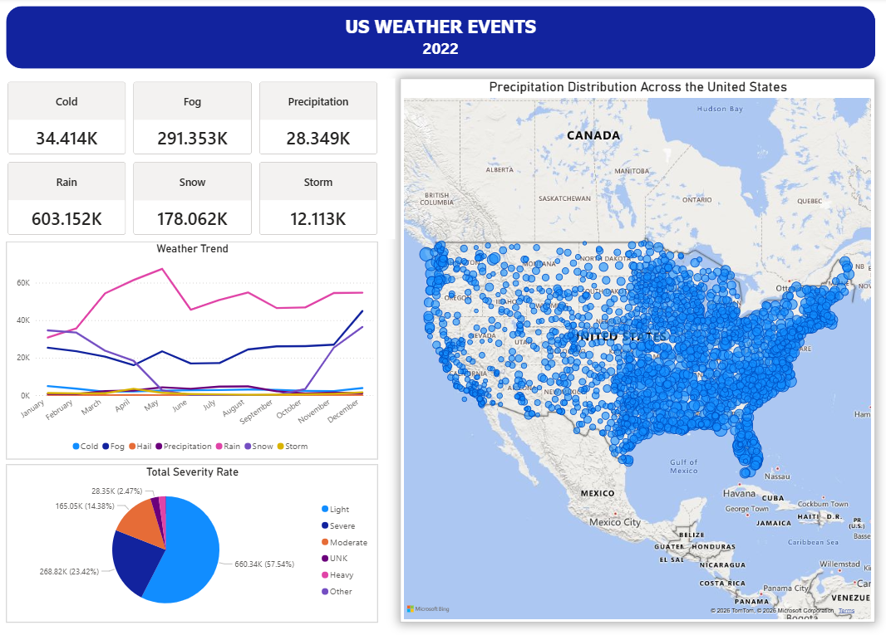

# 🌦️ US Weather Events Analysis

---
## Project Overview
This project analyzes weather event patterns across the United States in 2022 using historical weather data.  
The goal is to identify the most frequent weather events, understand seasonal trends, and determine geographic areas most impacted by precipitation.  
It demonstrates how data analytics can provide insights into weather patterns and support decision-making in sectors like transportation and emergency management.

---
## Tools Used
Python  
Power BI  
Excel  

---
## Dataset
US Weather Events Dataset from Kaggle.  
Key columns include:  
`EventId`, `Type`, `Severity`, `StartTime(UTC)`, `EndTime(UTC)`, `Precipitation(in)`, `TimeZone`, `AirportCode`, `LocationLat`, `LocationLng`, `City`, `County`, `State`, `ZipCode`

---
## Key Analysis
- Total weather events by type (rain, fog, snow, storm, etc.)  
- Monthly trend analysis to observe seasonal changes  
- Severity level distribution of weather events  
- Geographic mapping of precipitation events across the US  

---
## Power BI Dashboard

---
## Key Insights
- Rain is the most frequent weather event in 2022  
- Weather events show clear seasonal patterns throughout the year  
- Most weather events fall under the **light severity** category  
- Precipitation events are concentrated in central and eastern US regions
